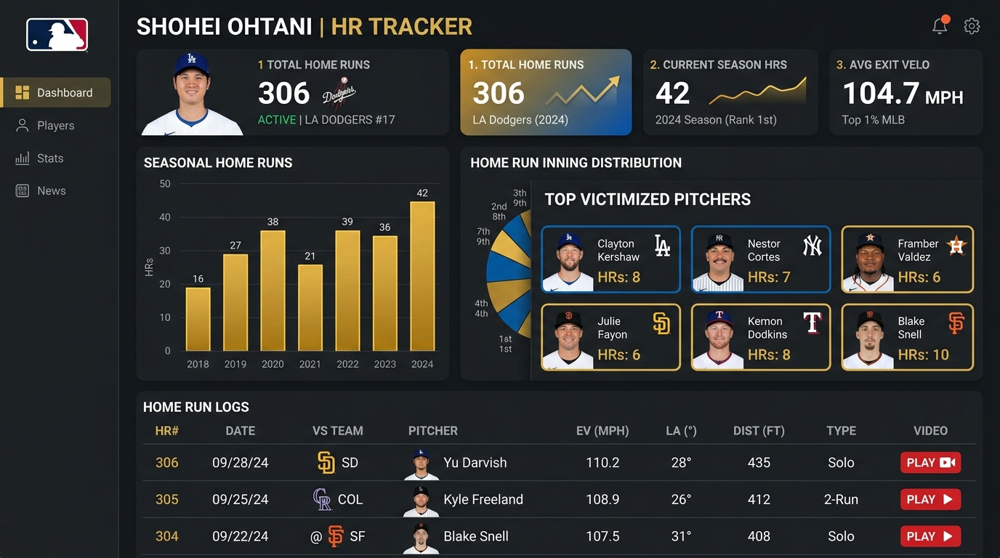
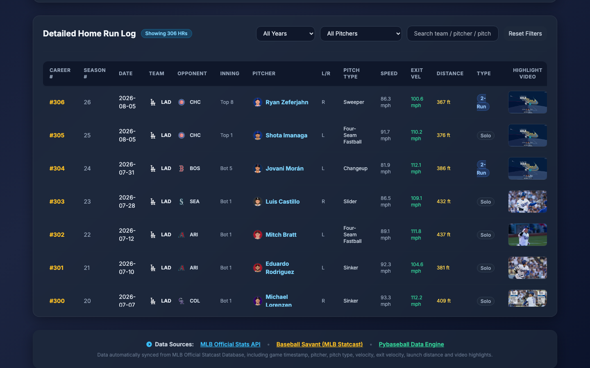

# ⚾ Shohei Ohtani Home Run Tracker & Pitcher Analysis (大谷翔平全壘打與被打投手統計)

[](https://github.com/murphytsai/ohtani-hr-tracker/actions)
[](https://murphytsai.github.io/ohtani-hr-tracker/)
[](https://opensource.org/licenses/MIT)

An interactive, real-time, bilingual (**English** / **Traditional Chinese**) web dashboard tracking all 300+ career MLB home runs hit by **Shohei Ohtani** (大谷翔平), complete with victimized pitcher analysis, MLB official team logos, pitcher headshots, and official video highlights.




---

## ✨ Features

- 🌐 **Bilingual Support (EN / 繁中)**: Toggle seamlessly between English (default) and Traditional Chinese.
- ⚡ **Automated Daily Sync**: Synced automatically every day via **GitHub Actions** directly from the official MLB Statcast & Live Feed API.
- 🎬 **Video Highlights & Thumbnails**: Watch official MLB HD video clips with video thumbnail previews or search via YouTube fallback.
- 🧢 **Team Logos & 3-Letter Abbreviations**: Official cap logo SVGs alongside team abbreviations (e.g. `LAA`, `LAD`, `NYM`, `NYY`).
- 👤 **Victimized Pitcher Headshots**: Official player headshots for all 250+ unique pitchers victimized by Ohtani.
- 📊 **Interactive Analytics Charts**:
  - **Yearly HR Count**: Breakdown of home runs hit per season.
  - **Inning HR Breakdown**: Distribution of home runs by inning (including 1st-inning leadoff HRs & Extra innings).
  - **Top 10 Victimized Pitchers**: Leaderboard of pitchers who surrendered the most HRs to Ohtani.
- 🔍 **Search & Multi-Filter**: Filter by Season, Pitcher name, Team, Pitch Type, or search keyword dynamically.

---

## 🛠️ Project Structure

```
ohtani-hr-tracker/
├── .github/workflows/
│   └── update.yml          # GitHub Actions daily automated data sync
├── build_web.py            # Python generator script for index.html (i18n & UI logic)
├── cron_update.py          # Master updater script (fetch + build)
├── generate_data.py        # Real-time MLB API & Statcast data fetcher
├── index.html              # Generated responsive web dashboard artifact
├── ohtani_hrs_mlb.json     # Complete dataset storing all career home run records
└── README.md
```

---

## 🚀 Quick Start (Local Setup)

### Prerequisites
- Python 3.8+
- `requests` library

### Installation & Running Locally

1. **Clone the repository**:
   ```bash
   git clone https://github.com/YOUR_GITHUB_USERNAME/ohtani-hr-tracker.git
   cd ohtani-hr-tracker
   ```

2. **Install dependencies**:
   ```bash
   pip install requests
   ```

3. **Fetch latest MLB data & build dashboard**:
   ```bash
   python cron_update.py
   ```

4. **Open `index.html`** in your browser or run a local HTTP server:
   ```bash
   npx serve .
   ```

---

## 🤖 Automated Daily Data Sync (GitHub Actions)

This repository includes a pre-configured GitHub Actions workflow (`.github/workflows/update.yml`).

- **Schedule**: Triggers daily at `00:00 UTC` (08:00 AM TST).
- **Behavior**: Fetches latest game logs from MLB API, updates `ohtani_hrs_mlb.json`, regenerates `index.html`, and commits changes automatically.

### How to enable GitHub Pages hosting:
1. Go to your repo **Settings** ➔ **Pages**.
2. Under **Build and deployment**, set **Source** to `Deploy from a branch`.
3. Set **Branch** to `main` / `/(root)`.
4. Click **Save**.

---

## 📊 Data Sources

- **[MLB Official Stats API](https://statsapi.mlb.com/)**: Live game feeds, player headshots, play-by-play logs, and video highlight clips.
- **[Baseball Savant (MLB Statcast)](https://baseballsavant.mlb.com/)**: Advanced metrics (Exit Velocity, Launch Angle, Total Hit Distance).

---

## 📄 License

This project is licensed under the [MIT License](LICENSE).
